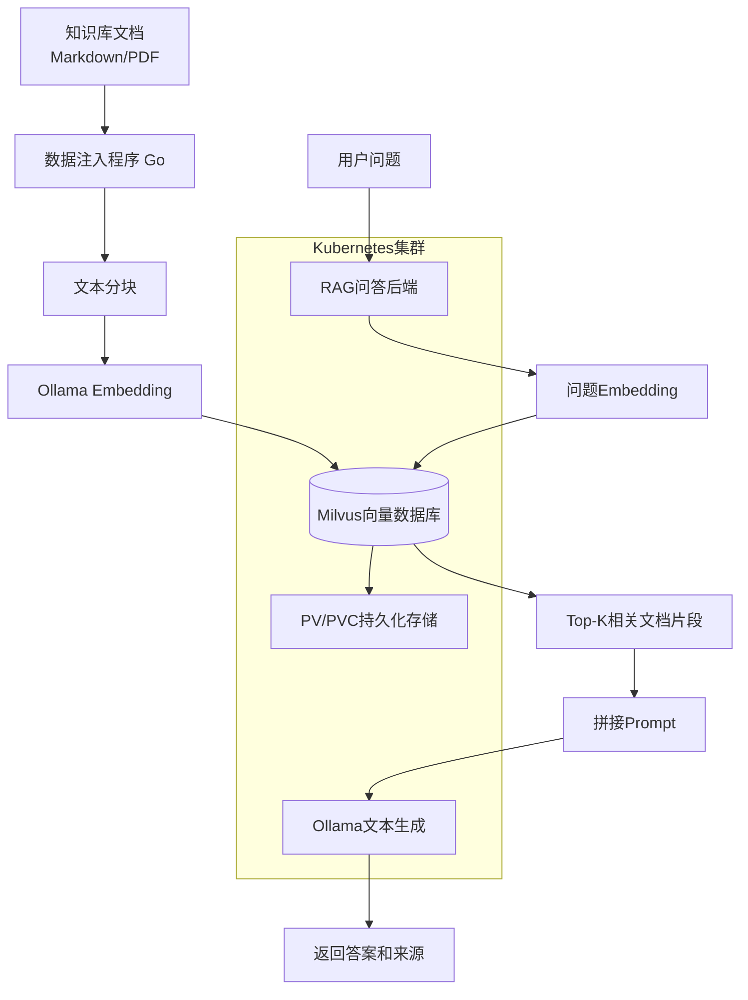
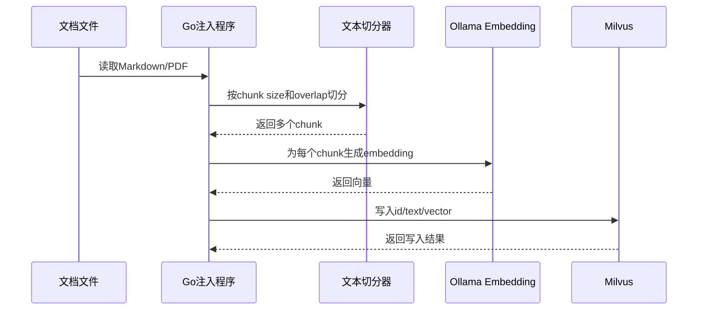
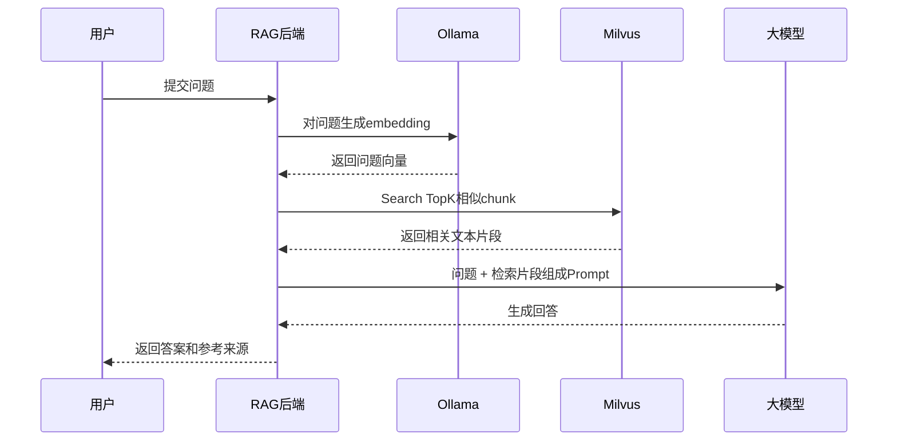

# rag-agent-gitops
## 1. 项目背景

大模型虽然知识很多，但有几个问题：

- 不一定知道我们自己的私有文档。
- 对最新文档或内部排障手册不了解。
- 直接回答容易出现“幻觉”。
- 企业知识分散在 Markdown、PDF、笔记、运维手册里。

RAG 的思路是：**不要让模型凭空回答，而是先从知识库里找相关资料，再让模型基于资料回答。**

## 2 项目整体规划
项目按五层来理解：

| 层次       | 做什么                 | 对应组件              | 面试表达                           |
| ---------- | ---------------------- | --------------------- | ---------------------------------- |
| 环境准备层 | 部署运行环境和基础组件 | K8s、Argo CD、PV/PVC  | 让 Milvus、Ollama 等组件能稳定运行 |
| 文档处理层 | 读取文档并切分 chunk   | Markdown/PDF、Go 程序 | 把长文档拆成可检索片段             |
| 向量化层   | 把文本转成 embedding   | Ollama embedding      | 让文本可以做语义相似度计算         |
| 检索存储层 | 存向量并做 Top-K 检索  | Milvus                | 根据问题找最相关片段               |
| 回答生成层 | 拼接上下文并生成回答   | Ollama、大模型        | 让模型基于资料回答，减少胡编       |

## 3. 总体架构图

## 4. 两条主流程

RAG 项目一般分两条链路：

| 链路         | 作用                   | 什么时候执行       |
| ------------ | ---------------------- | ------------------ |
| 数据注入链路 | 把文档处理后写入向量库 | 添加或更新知识库时 |
| 问答查询链路 | 根据用户问题检索并回答 | 用户提问时         |

### 4.1 数据注入流程图

### 4.2 问答查询流程图

## 5. 每个组件干什么

| 组件             | 作用       | 面试口语化解释                      |
| ---------------- | ---------- | ----------------------------------- |
| knowledge-base   | 存原始文档 | 比如 Go 文档、K8s 排障手册          |
| Go 注入程序      | 处理文档   | 读取、切分、向量化、入库            |
| 文本切分器       | 生成 chunk | 把长文档切成小片段                  |
| Ollama Embedding | 生成向量   | 把文本变成数字向量                  |
| Milvus           | 向量数据库 | 存向量，并做相似度检索              |
| RAG 后端         | 查询入口   | 接收问题，检索知识，调用模型        |
| Ollama LLM       | 生成回答   | 基于上下文回答问题                  |
| PV/PVC           | 持久化     | 保存 Milvus 数据，防止 Pod 重启丢失 |
